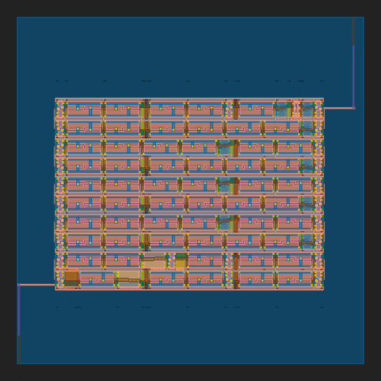
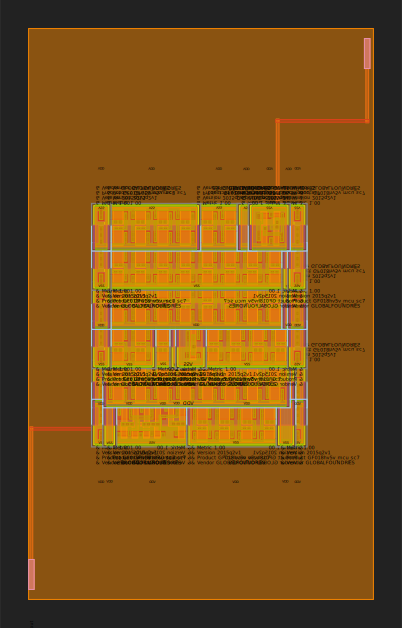
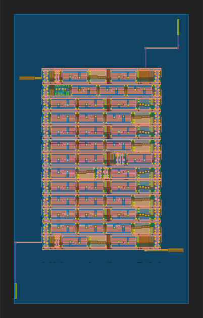
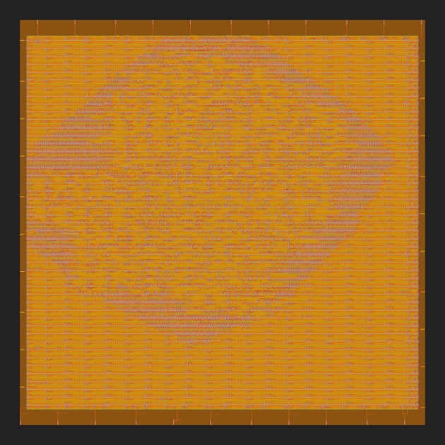
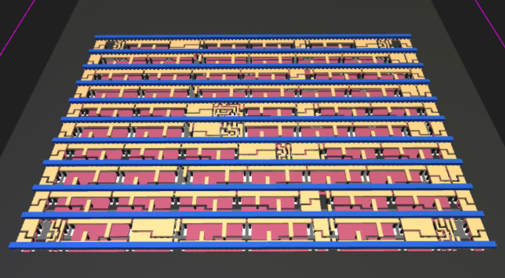

# Silicon Notebooks

Build open silicon using [Jupyter](https://jupyter.org/) and [Colab](https://colab.research.google.com/) notebooks.

## Notebooks

### Digital Inverter with OpenLane and SKY130 PDK [](https://colab.research.google.com/github/chipsalliance/silicon-notebooks/blob/main/digital-inverter-openlane.ipynb)

[digital-inverter-openlane.ipynb](digital-inverter-openlane.ipynb)

Run a simple inverter design thru the [OpenLane](https://github.com/The-OpenROAD-Project/OpenLane/) GDS to RTL flow targeting the [open source SKY130 PDK](https://github.com/google/skywater-pdk/).



### Digital Inverter with OpenLane and GF180MCU PDK [](https://colab.research.google.com/github/chipsalliance/silicon-notebooks/blob/main/digital-inverter-openlane-gf180mcu.ipynb)

[digital-inverter-openlane-gf180mcu.ipynb](digital-inverter-openlane-gf180mcu.ipynb)

Run a simple inverter design thru the [OpenLane](https://github.com/The-OpenROAD-Project/OpenLane/) GDS to RTL flow targeting the [open source GF180MCU PDK](https://github.com/google/gf180mcu-pdk/).



### Analog Inverter with Magic [](https://colab.research.google.com/github/chipsalliance/silicon-notebooks/blob/main/analog-inverter-magic.ipynb)

[analog-inverter-magic.ipynb](analog-inverter-magic.ipynb)

Draw a simple mosfet for the [open source SKY130 PDK](https://github.com/google/skywater-pdk/) using [MAGIC](https://github.com/RTimothyEdwards/magic) and simulate it in an inverter circuit using [PySpice](https://pyspice.fabrice-salvaire.fr/).


### XLS adder with OpenLane [](https://colab.research.google.com/github/chipsalliance/silicon-notebooks/blob/main/xls-adder-openlane.ipynb)

[xls-adder-openlane.ipynb](xls-adder-openlane.ipynb)

Run a simple 1-bit adder design using the [XLS](https://google.github.io/xls/) high level synthesis toolkit thru the [OpenLane](https://github.com/The-OpenROAD-Project/OpenLane/) GDS to RTL flow targeting the [open source SKY130 PDK](https://github.com/google/skywater-pdk/).



### SERV SoC with OpenLane and GF180MCU PDK [](https://colab.research.google.com/github/chipsalliance/silicon-notebooks/blob/main/serv-openlane-gf180mcu.ipynb)

[serv-openlane-gf180mcu.ipynb](serv-openlane-gf180mcu.ipynb)

Run [subservient](https://github.com/olofk/subservient): a SERV-based SoC design thru the [OpenLane](https://github.com/The-OpenROAD-Project/OpenLane/) GDS to RTL flow targeting the [open source GF180MCU PDK](https://github.com/google/gf180mcu-pdk/).



### XLS workshop with OpenLane [](https://colab.research.google.com/github/chipsalliance/silicon-notebooks/blob/main/xls-workshop-openlane.ipynb)

[xls-workshop-openlane.ipynb](xls-workshop-openlane.ipynb)

#### From code to silicon using XLS and OpenLane

- Design your hardware with code using [XLS](https://google.github.io/xls/) high-level synthesis toolkit.
- Run your design thru the [OpenLane](https://github.com/The-OpenROAD-Project/OpenLane/) RTL to GDS toolchain.
- Target the open source [SKY130](https://github.com/google/skywater-pdk/) PDK to manufacture your design using Google's sponsored [OpenMPW shuttle](https://developers.google.com/silicon) program.



### Generate SRAM macros with OpenRAM using the SKY130 PDK [](https://githubtocolab.com/sfmth/openram-playground/blob/main/OpenRAM.ipynb)

[OpenRAM.ipynb](OpenRAM.ipynb)

Generate an SRAM macro from a configuration file using the [OpenRAM](https://github.com/VLSIDA/OpenRAM) memory compiler using the [open source SKY130 PDK](https://github.com/google/skywater-pdk/).


## Maintainance

- Install development dependencies

```
python3 -m venv env
source env/bin/activate
python -m pip install -e requirements-dev.txt
```

- Lint notebooks

```
nbqa flake8 *.ipynb
```

- Run notebooks

```
pytest --nbmake *.ipynb
```
